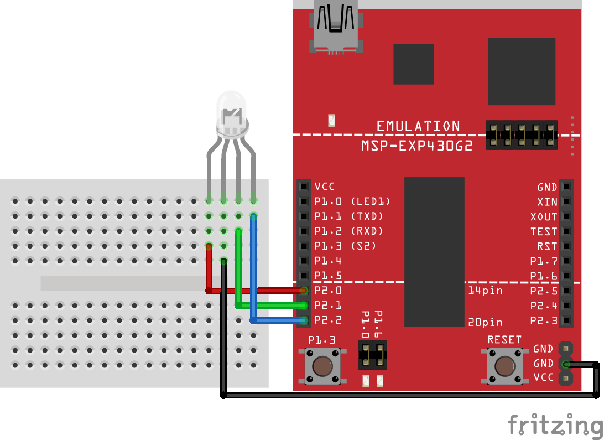

# Assignment Two: RGB LED

### Schematic

### Objective

For this assignment, you should try to cycle through the available colors on your RGB LED slowly and, when the onboard switch is pressed, display the current color to the screen using `cio_printf()`. The following colors can be displayed:

1. Red
1. Green
1. Blue
1. Yellow
1. Cyan
1. Purple
1. White

Here is sample output from `minicom`:

    > OFF
    > RED
    > GREEN
    > BLUE
    > YELLOW
    > CYAN
    > PURPLE
    > WHITE

##### Note: `OFF` is part of the color cycling, so there are 8 different "colors" to display.

The order in which they are displayed isn't that important, but the above order makes a bit of sense. You should use an _interrupt_ to print the name of the color to the screen while the main loop consists of cycling through the colors. The included code has something set up for you (see the comments).

Now that we have slogged through coding in assembly, you should try to use the power that the C programming language grants you. Data structures can be created for this task that will benefit you greatly.

Remember that, if you need to access a variable inside an interrupt, that variable will need to be placed in the global scope (outside any functions). You should be able to program this only using the `main()` function and a single interrupt service routine (ISR).

