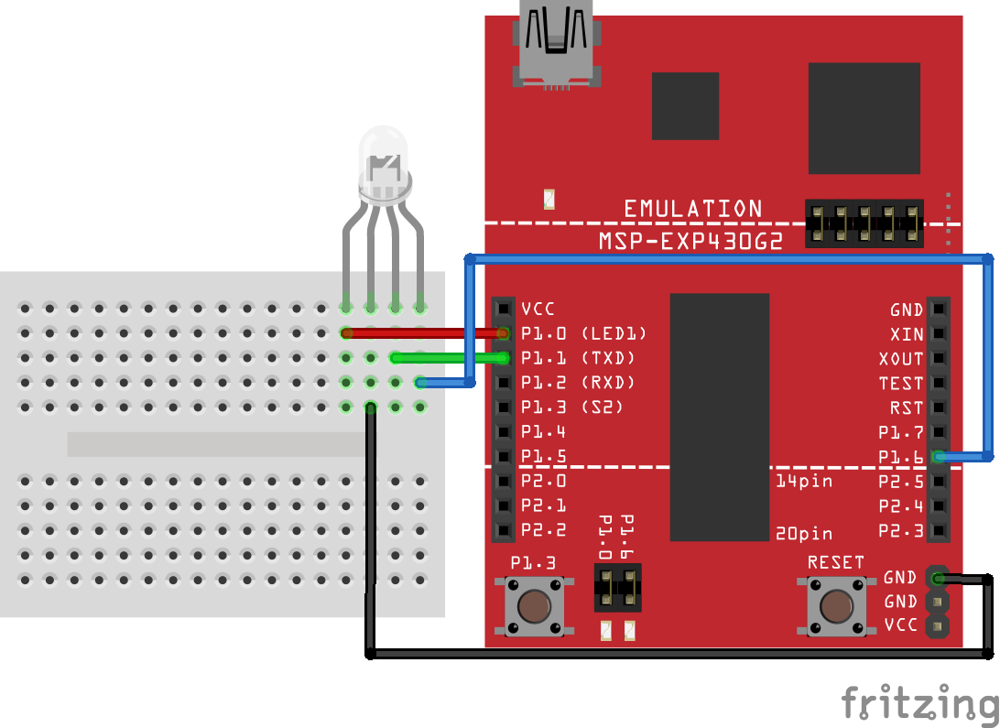

# Assignment Three: Signals

### Schematic

### Running Modes

##### Mode 1

1. Red LED blinks every 1/2 a second (using execution loop)

##### Mode 2

1. Red LED blinks every 1/2 second (using execution loop)
2. Green LED blinks every 1/3 second (using timer & interrupt)

##### Mode 3

1. Red LED turns off
2. Green LED blinks every 1/3 second (using timer & interrupt)
3. Blue LED blinks every 1/4 second (using timer & signal)

##### Mode 4

1. Red LED stays off
2. Green LED turns off
3. Blue LED blinks slower, every 1/2 second (using timer & signal)

### Objective

For this assignment, you should attempt to recreate the RGB LED activity listed above _with the method inside parenthesis_.

Because you are using the button as an interrupt, the completed program with have some initialization, execution loop and two interrupts: one for **TIMER0_A0_VECTOR** and one for **PORT1_VECTOR**.

