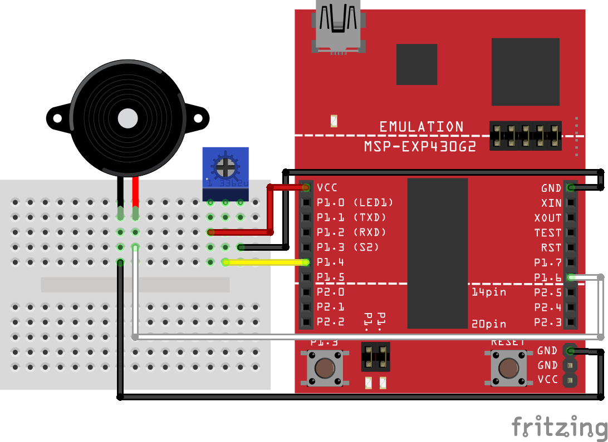

# Assignment Four: Potentiometer

### Schematic

### Objective

For this assignment, you should try to use the potentiometer and button to enter notes into a linked list of structs.

I've given you the start of a file that has blocks outlined for what I think you need.

So, the note will play out the speaker and you can set the note with the potentiometer. Pressing the button adds a new note to the linked list and then you can set the pitch of that one.

### Extra Credit

If you can figure out a way to actually play it back by quickly double-tapping the button.

